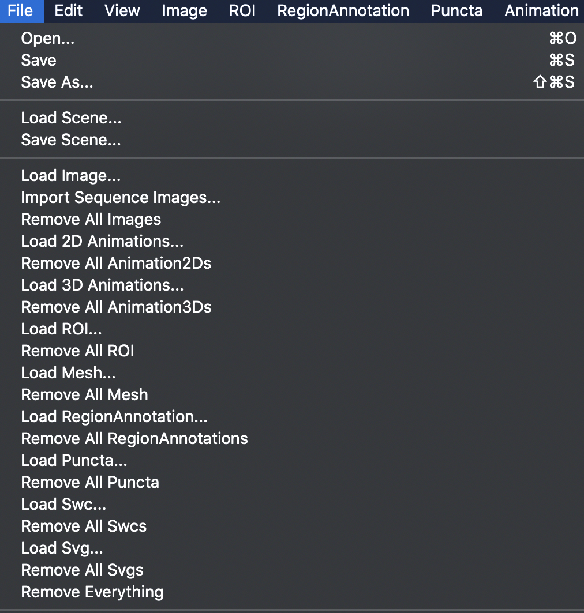
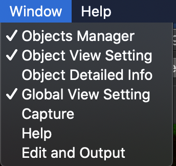

Atlas Tutorial
==============

Contents
^^^^^^^^ 

1. Getting Started
^^^^^^^^^^^^^^^^^^

.. raw:: html

    

        <iframe src="//www.youtube.com/embed/E8J-MxkBskE" frameborder="0" allowfullscreen style="position: absolute; top: 0; left: 0; width: 100%; height: 100%;"></iframe>
    

1.1 Installation
^^^^^^^^^^^^^^^^
* Download the Installation File link below (when published then link will be added)
* Decompress the Downloaded Zip File

1.2 Launch the Program
^^^^^^^^^^^^^^^^^^^^^^
* Excutable: 
* Mac: AtlasInstaller.app
* Windows: AtlasInstaller.exe
* Linux: AtlasInstaller

2. Technical Details
^^^^^^^^^^^^^^^^^^^^
2.1 Text Tutorials
^^^^^^^^^^^^^^^^^^
2.1.1 General Functions
^^^^^^^^^^^^^^^^^^^^^^^ 
File -> Open...

Open a file, which can be a TIFF or an SWC file or others
You can simply open a file(your image file) with this function

Or (second way to open a file)

File Icon (First picture)
Open an existing scene file

Edit (You can edit the file below function)

Undo/Redo/Copy/Paste/Start Dictation...

* Atlas supports unlimited undo/redo for most SWC & others editing operations

View (Adjust how to display of your file) 

Zoom In(Command & +) / Zoom Out(Command & -) /

Image (Adjust the Image, functions below)

ROI (Manual Delineation of Region of Intierests (ROIs)

Obtain the surface ROIs, surface editing functions

Region Annotation

Import Label Image... (You can use this function with your labeled image)

Puncta (Defined circular area above and around the nucleus of all transfected cells)

Animation (You can create your own 2D/3D video with this function)

Open 3D Window (You can visualize your image in 3D)

Window (You can open & close the below function, when you open the function, you can check the  right side box)

Help (You can serch the function you want)

2.1.2 Keyboard Shortcuts
^^^^^^^^^^^^^^^^^^^^^^^^
* Command referred to as Ctrl for Windows PC 

* 2D Image Control

* zoom: 

1) command/control & +(bigger), -(smaller)

2) + / - 

* zoom in/out to location:

1) + / - while pointing mouse cursor to the target location

* 3D Image Control

* zoom/dolly:

1) command/control key + mouse wheel scroll 

2) command/control key + =(+)/- key 

3) mouse wheel scroll (might be slow if image is rendered in full-resolution) 

4) =(+)/- key (might be slow if image is rendered in full-resolution)

* rotate: 

1) mouse drag

2) command/control key + Left/Right/Up/Down key

* shift: 

1) shift key + mouse drag
2) shift key + Left/Right/Up/Down key (might be slow if image is rendered in full-resolution)

* roll:

1) alt key + mouse drag

2) alt key + Left/Right key (might be slow if image is rendered in full-resolution)

* General Shortcut Functions

3 Tutorials and Examples
^^^^^^^^^^^^^^^^^^^^^^^^

3.1 3D Animation Tutorial
^^^^^^^^^^^^^^^^^^^^^^^^^

1. Load Image
Load image by dragging file into Atlas window or using the File menu.
Loaded image will be shown in the upper right "Object Manager" panel: 

Click the file name in the “Object Manager” panel will show its visualization parameters in the bottom right “Object View Setting” panel:

This is the 2D view, click “Open 3D Window” in the toolbar will bring out the 3D view:

Deselect object in “Object Manager” panel (by clicking the empty space) the moving handles and the yellow bound box will disappear. “Object View Setting” controls the rendering of individual object, for example, “Full resolution rendering” could be toggled here for large image. In the “Object View Setting”, “Transformation Parameters” control the size and location of object in 3D view:

For example, if z resolution is 1um/pixel and xy resolution is 0.2 um/pixel, we can change the z scale to 5 to show the image in correct aspect ratio:

 
Channels can be turn on or off by using the “Show Channel X” parameters:

  
Click “Transfer Function X” will bring out the Transfer Function editor for channel X. Contrast, color, and transparency of each channel can be adjusted in this editor:

Transfer function is piecewise linear function to map pixel intensity (x axis) to color and opacity (y axis). Double click the key (circle) will bring out the color dialog so we can change the key color. Here we change it from green to red then this channel will be shown in red:

To adjust the contrast, we can add more keys to the piecewise linear function. The default linear function show pixel with intensity 0(min) as black and pixel with intensity 255(max) as full red. If the signals in this channel are weak and we want to make weak signals visible, we can add new key around pixel intensity 100 and make its color full red. To do so we double click in the plot in place around intensity 100 and change the color of new key full red:

Now the contrast is increased. Keys can be deleted by selecting and pressing delete key, and can also move around with mouse dragging.

Other parameters:
Compositing: controls 3D rendering style
Show X/Y/Z slice: show additional 2D slice of the 3D volume, slice position can be controlled by “X/Y/Z Slice Position” parameters, slice color can be controlled by “Slice Channel X Colormap” parameters. Colormap is simply transfer function without opacity, its editor is similar to the transfer function editor.
X/Y/Z Cut: show a subvolume of the 3D image
Bound Box: control the color, line width, and on/off of 3D image bound box

Here is an example of changing these parameters:

To change (turn on/off) background and axis, or to take screenshot, use the toolbar:

Now to make an animation video, click Menu “Animation -> Make 3D Animation”

A new animation object will show in the “Object Manager” panel. Double click it to show the animation timeline:

Click “Cmd+S” (or “Ctrl+S” on non-Mac) to save the animation to file:

Atlas uses a keyframe based animation system. After setting the duration, user select a “current time”, adjust the 3D scene of that time by using the mouse and “Object View Setting”, then click the “Save Key Frame” button, all view parameters will be recorded. View parameters, including camera position, angle, background color, axis, and object view settings, will be interpolated between key frames. For example, we rotate the camera a little bit, cut off part of image with “Y Cut”, and change the background color, then save it as a key frame in 5 secs:

Zoom out a little we can see how camera moves:

To see how each view parameter changes in the timeline, 

We can see that most parameters are not changed, except the “Y Cut” as we mentioned:

We can control how to interpolate the view parameter by change the “Type” in the “Key editor dialog” (see above). Default is linear (or switch for parameters that cannot interpolate such as on/off). Many advanced options are provided, see http://doc.qt.io/qt-5/qeasingcurve.html for details.

Use the play controls to preview, if everything looks good, we can export it as a video. Click the camera button to bring out the export UI:

Remember to save (Cmd+S or Ctrl+S) all the time to avoid data loss. Saved animation file (movie script, with file extenstion “.animation3D”) can be loaded into Atlas by drag-n-drop or File menu.

Additional Notes

1. Click “Reset Camera” in toolbar to focus on current visible objects. Suggest doing it after adjusting Z scale as the camera focus point needs to be updated.

2. To make a simple video of camera rotating around object 360 degrees, we need to create 5 key frames: the initial view, rotate 90, rotate 180, rotate 270, and rotate 360 for camera to interpolate its path correctly. It’s hard to control the exact camera position with mouse, so we provided some UI controls in “Global View Setting” panel:

3.2 Fluorescence Microscopy Image with Atlas
^^^^^^^^^^^^^^^^^^^^^^^^^^^^^^^^^^^^^^^^^^^^^^^^^^^^^^

3.2.1 3D Mouse Brain Modeling & Visualization
^^^^^^^^^^^^^^^^^^^^^^^^^^^^^^^^^^^^^^^^^^^^^

Figure1. Atlas 3D Visualization. Use of Atlas in visualizing a digital model of a mouse brain. 

Grey voxels: 3D volumetric image of a mouse brain; turquoise, lavender, and ultramarine blue voxels: Mouse Hippocampus; shows structure and functions in great detail. Black boxels: Aligned interpolation.    

Atlas visualization: From the global viewer, object viewers from various brain regions can be initialized. Object viewers can have their own transform parameters, scale, rotation, transition, rotation center, channels, and color maps independently of the global viewer. 

3.3 Image Stitching & Stacks & Cell Signals & 3D Visualization  
^^^^^^^^^^^^^^^^^^^^^^^^^^^^^^^^^^^^^^^^^^^^^^^^^^^^^^^^^^^^^^

* Figure1. Atlas Stitching Function 
Images obtained from fluorescene microscopes or digital microscope, alline, realign, and combine microscope images of different parts of the sample, stitching function is needed. 
Atlas stitching function provides a seamlessly stitch microscope images together in a nifty ans faster to merge multiple microscope images into a single image. 

The process of combining multiple 2D/3D images with overlapping fields of view to produce a high resolution image. By stitching overlapping image tiles, it is enable to visualize the images in one scene, time-lapse studies of entire cell cultures in multiple imaging modalities. 

.. image:: images/stitch1.png
  :width: 800px
  :height: 400px
  :scale: 100%
  :alt: Atlas Figure1
  :align: center

.. image:: images/stitch4.png
  :width: 800px
  :height: 400px
  :scale: 100%
  :alt: Atlas Figure1
  :align: center

(** I do not have the images, so used the previous movie **) 

* Figure3. Creating 3D Neuron Reconstructions from Image Stacks and Virtual Slides

* Z-projection (a digital image processing method, combines multiple images taken at different focal distances Z-stacking to provide a composite image with a greater depth of field) 

(need to add pics)

* Process a confocal image 

(need to add pics) 

* Neuron Visualization 

 

* Figure3. Signals 
 

.. image:: images/signal1.png
  :width: 800px
  :height: 400px
  :scale: 100%
  :alt: Atlas Figure1
  :align: center

.. image:: images/signal2.png
  :width: 800px
  :height: 400px
  :scale: 100%
  :alt: Atlas Figure1
  :align: center

 
3.4 Brain Reference Atlases & Mapping your Own Data  
^^^^^^^^^^^^^^^^^^^^^^^^^^^^^^^^^^^^^^^^^^^^^^^^^^^

The Allen Mouse Brain Atlas includes a high-resoulution anatomic reference atlas. Atlas SW have a tool for mapping your own data. We have done our Lemur Brain data with Atlas SW. 

* Figure2. Atlas Lemur Brain Visualization 

.. image:: images/lemur2.png
  :width: 800px
  :height: 200px
  :scale: 100%
  :alt: Atlas Figure1
  :align: center

.. image:: images/lemur3.png
  :width: 800px
  :height: 300px
  :scale: 100%
  :alt: Atlas Figure1
  :align: center

To assist your annotation, you can see the below video 

.. raw:: html

    

        <iframe src="//www.youtube.com/embed/ZNA0Q2Gygsc" frameborder="0" allowfullscreen style="position: absolute; top: 0; left: 0; width: 100%; height: 100%;"></iframe>
    

3.5 Cell Visualization
^^^^^^^^^^^^^^^^^^^^^^

Cell nuclei in microscopic image visualization.
Previously, Feng lab used Atlas to visualize and analyze the cell nuclei images.
Used Atlas annotation function and applied Deep Learning Mask R-CNN method to train the image sets and have achieved state-of-the-art nucleus segmentation.

Atlas permits interactive by moving the computer mouse, users can adjust the function of rotation, zoom,and 3D pan with video. 

3.6 Human Brain MRI Image Visualization
^^^^^^^^^^^^^^^^^^^^^^^^^^^^^^^^^^^^^^^

To visualize the MRI, Atlas is suitable platform to see the brain vessels, tumor, and other tomur core channels.  
These are "Brain Tumor Segmentation Dataset (BraTS) Challenge" dataset images used.
BraTs has been focusing on the evaluation of state-of-the-art methods for the segmentation of brain tumors in multimodal magnetic resonance imaging(MRI) scans. 
BraTs annotations & structures for BraTS 2020, 
Image patches with the tumor sub-regions annotated in the different MRI modalities, whole tumor(Edema/Invasion), tomur core(non-enhancing), enhancing tumor, and necrosis were visualized by Atlas. 

 

* 3D Brain Vessel Visualization
Atlas can visualize the brain vessel image. Image analysis plays a pivotal role, which gives a clue in identifying the different manifestation of Human Cerebral Small Vessel Disease(CSVD). Atlas is used to visualize the microcirculation vascular integrity of individuals with and without CSVD. It is also used to visualize the blood vessel network of brains from non-invasive 3D-time-of-flight Magnetic Resonance Angiography (MRA) images. The quantitative analysis of the reconstructed blood vessel network provides potentially valuable information for the diagnostic and monitoring of CSVD. 

 
